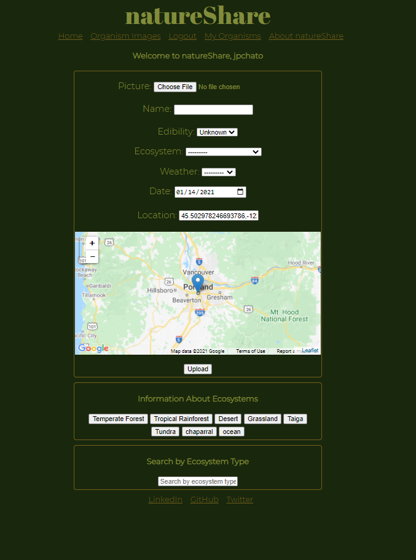
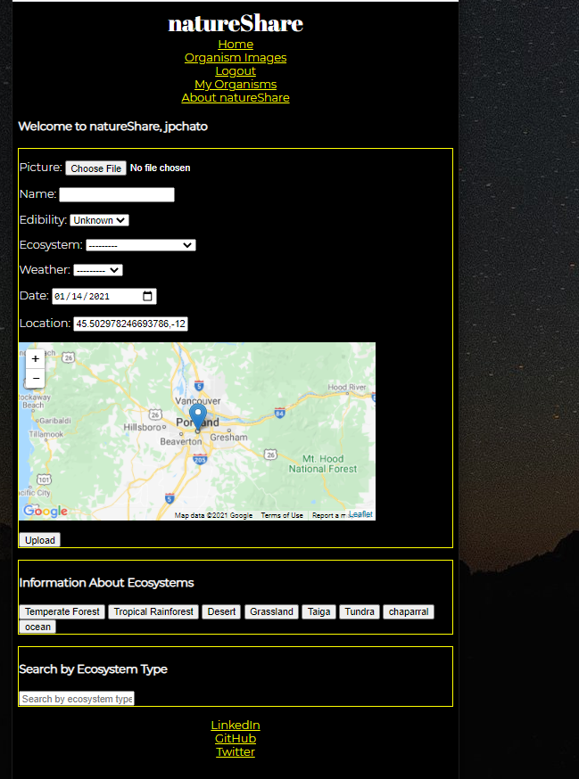

# natureShare
* An app that allows users to share information about organisms they find in nature.

# Motivation
* This is a project my wife and I came up with the idea that it could help her keep track of where she finds edible mushrooms and other foraging foods in the forests of the PNW.

# Build Status
* Currently deployed on Heroku

# Code Style
* Python, JS, vue.js, and Django syntax

# Screenshots
* Desktop View
* 
* Mobile View
* 

# Features
* Users are able to upload images and accompanying data relative to the image. 
* Users can search by ecosystem type. Users can view all organisms but they can only edit and delete their own organisms. 
* Users can share images to twitter with the organism title and link to the detail view of that organism.
* Users are able to register accounts to login and logout.
* Users can use google map to add lat/lon data for image

# natureShareApp
* app that allows CRUD of organisms from django Organism model

# accounts
* app for creating and managing users

# Reference Links
### [settings.py:](https://www.geeksforgeeks.org/python-uploading-images-in-django/)
* Reference link for how I added the ability for users to upload images.
### [forms.py:](https://stackoverflow.com/a/35968816/14263621)
* Reference link for how I added classed based views in the views.py
### [models.py:](https://stackoverflow.com/a/35968816/14263621)
* Reference link for how I set the default google map coordinates to point to Portland, OR
### [urls.py in natureShareApp:](https://learndjango.com/tutorials/django-search-tutorial)
* Reference link for how I created a search bar
### [views.py in natureShareApp:](https://stackoverflow.com/a/62727319/14263621)
* Reference link for how I created a classed based view user model without showing the user
### [views.py in natureShareApp:](https://www.geeksforgeeks.org/python-uploading-images-in-django/)
* Reference link for how I added the ability for users to upload images. Referenced in multiple files
### [views.py in natureShareApp:](https://stackoverflow.com/a/8595758/14263621)
* Reference link for how I added the ability for users to only edit their own organisms and not other users' organisms
### [organism_detail.html in templates:](https://developers.google.com/maps/documentation/javascript/adding-a-google-map#all)
* Reference link for how I added google map to my template
### [organism_detail.html in templates:](https://www.geeksforgeeks.org/how-to-insert-a-javascript-variable-inside-href-attribute/)
* Reference link for how I manipulated a script tag to use django secret key

# Python Libraries to Install
* asgiref==3.3.1
* Django==3.1.4
* django-geoposition==0.3.0
* django-location-field==2.1.0
* Pillow==8.0.1
* python-dotenv==0.15.0
    * only used for development to hide keys
* pytz==2020.4
* six==1.15.0
* sqlparse==0.4.1
* whitenoise==5.2.0